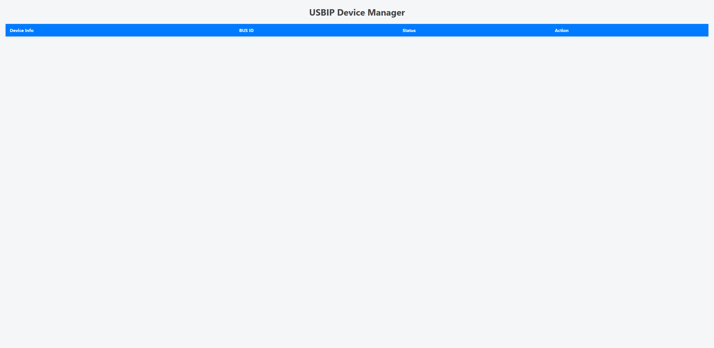
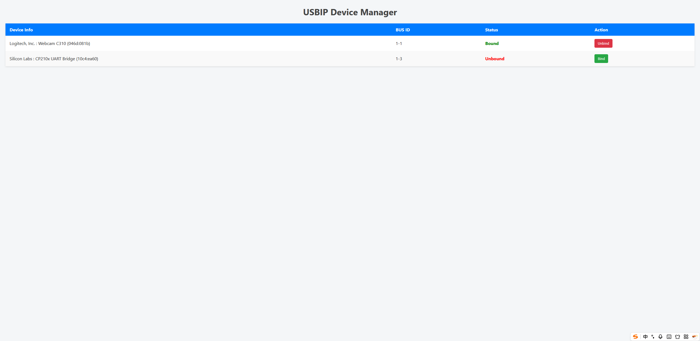

# USBIP Web Management Interface (Based on Flask + WebSocket)

This is a lightweight management tool that allows real-time viewing and control of USBIP device binding status through a web interface.
It is designed for devices such as iStoreOS.
The project runs inside a Docker container, but **USBIP commands are executed on the host machine.**

---

## Features and Highlights

- Real-time display of USB device list (BUS ID / Device Info / Binding Status)
- One-click Bind / Unbind operations
- Real-time device status updates via WebSocket
- Clean and responsive web interface, optimized for both mobile and desktop

---

## Screenshot Preview




---

## Project Structure

```
usbip_web/
├── app.py               # Main Flask application
├── usbip_utils.py       # Utility module for executing USBIP commands on the host
├── Dockerfile           # Docker build configuration
├── docker-compose.yml   # One-click deployment configuration
├── templates/
│   └── index.html       # HTML template for the web interface
└── static/
    ├── main.js          # Frontend logic (including WebSocket handling)
    └── style.css        # Styling and layout
```

---

## System Requestment

- [iStoreOS](https://github.com/istoreos/istoreos) based OpenWRT
- usbip-server
- docker & docker-compose

## Prerequisites

- The host (iStoreOS) must have usbip properly installed and configured

- The usbip command must be accessible from within the container (via volume mounting)

- USB devices on the host must support USBIP and have the correct drivers bound/unbound as needed

### 1. Prepare the Project

Upload the entire usbip-webui project to your iStoreOS router, or clone it using the following commands:

```
git clone https://github.com/ChongZhiJie0216/usbip-webui
cd usbip-webui
```

---

### 2. Start the Service

Launch the service using Docker Compose:

```
docker-compose up -d
```

---

### 3. Access the Web Interface

Open your browser and visit:

```
http://<你的iStoreOS IP>:8080
```

You can now view and manage your USBIP devices.

---

### ⚙ docker-compose.yml

```yaml
version: "3.8"
services:
  usbip-web:
    container_name: usbip_web
    build: .
    ports:
      - "8080:5000"
    privileged: true
    volumes:
      - /dev/bus/usb:/dev/bus/usb
      - /sys/bus/usb:/sys/bus/usb
      - /sys/devices:/sys/devices
      - /dev:/dev
    restart: unless-stopped
```

---

### Mounting Instructions

| Host Path      | Purpose                                                          |
| -------------- | ---------------------------------------------------------------- |
| `/dev/bus/usb` | Read USB device information                                      |
| `/sys/bus/usb` | Determine device binding status                                  |
| `/sys/devices` | Retrieve device descriptions and driver info                     |
| `/dev`         | Required for certain system-level interactions with device nodes |

---

## Notes

This container does not provide USB device sharing services (usbipd); it only offers a management frontend

All actual USBIP operations are executed via the host's usbip tools

The web interface listens on port 8080 by default; you can modify this as needed

---

## Sources

| Server Sides                                                                    | Client Sides                                                  |
| ------------------------------------------------------------------------------- | ------------------------------------------------------------- |
| [USB over IP tunnel](https://openwrt.org/docs/guide-user/services/usb.iptunnel) | Windows :[usbip-win2](https://github.com/vadimgrn/usbip-win2) |
